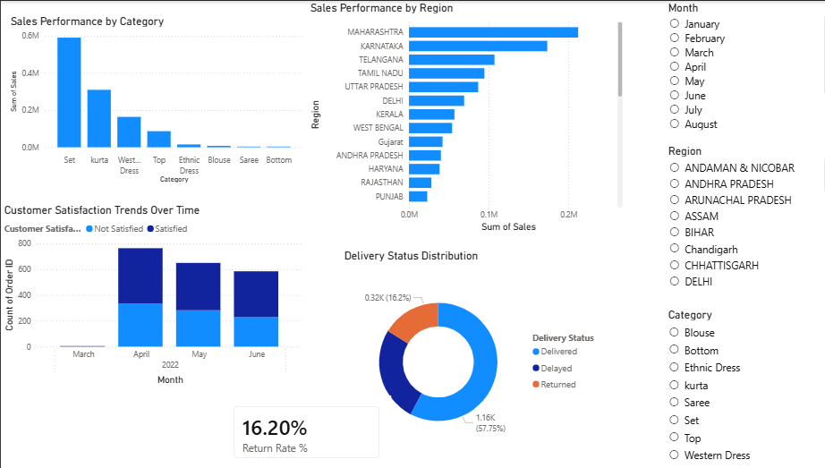

# Sales Analytics Dashboard (Power BI)

## Overview

This project presents an interactive Power BI dashboard designed to analyze sales performance, customer behavior, and delivery efficiency in an e-commerce scenario.

## Dashboard Preview

## Features

* Sales performance by category and region
* Customer satisfaction trends over time
* Delivery status distribution (Delivered, Delayed, Returned)
* Return rate analysis (16.2%)

## Tools Used

* Power BI
* Power Query (data transformation)

## What I Did

* Cleaned and transformed raw data using Power Query
* Created calculated fields such as total sales and delivery status
* Designed interactive visuals and filters for dynamic analysis

## Key Insights

* Identified high-performing regions and product categories
* Observed a relationship between delivery delays and customer satisfaction
* Highlighted return rate trends impacting business performance

## Purpose

To demonstrate how data visualization can support data-driven decision-making in a business context.
